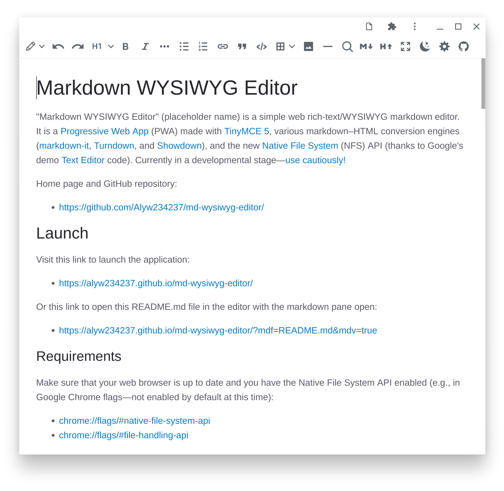
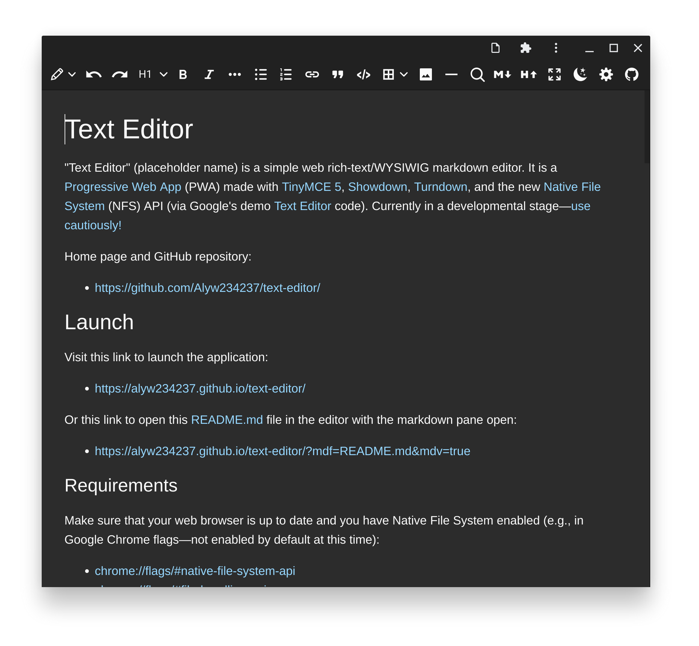
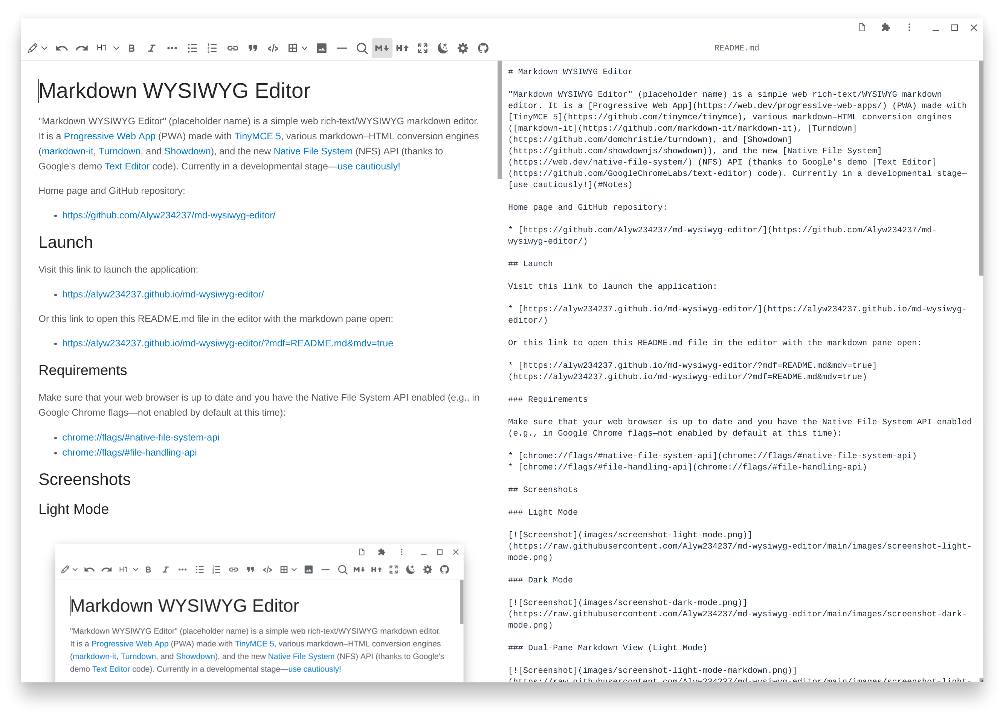
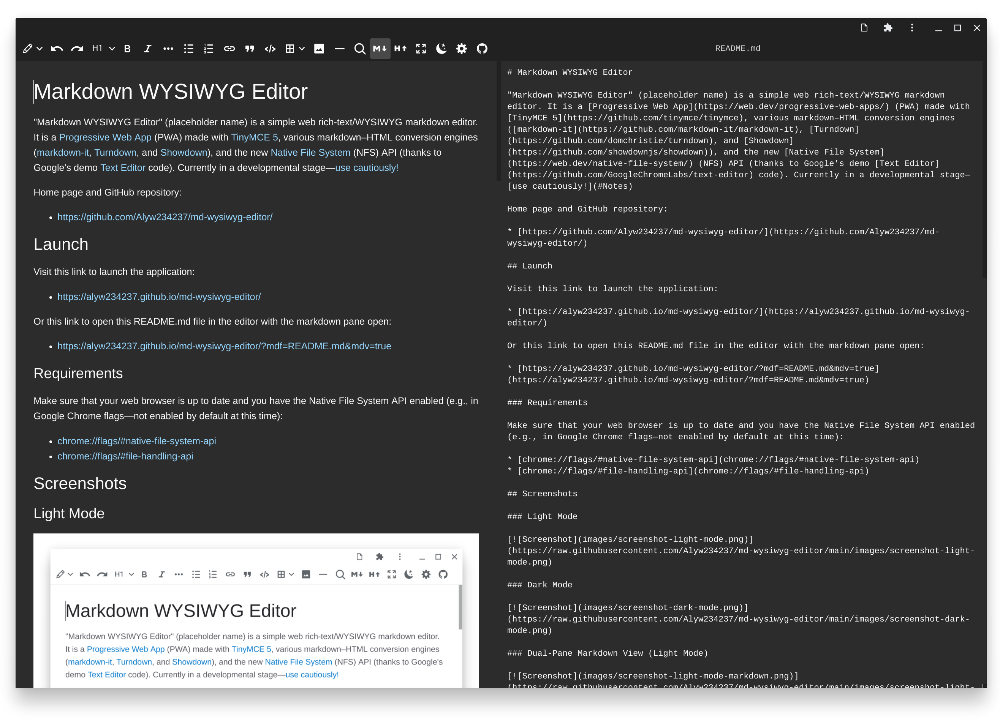
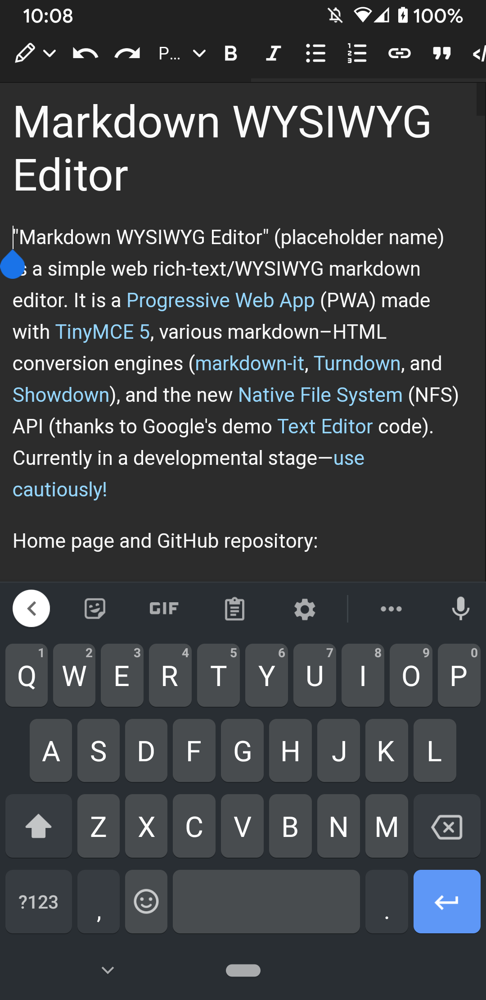

# Markdown WYSIWYG Editor

"Markdown WYSIWYG Editor" (placeholder name) is a simple web rich-text/WYSIWYG markdown editor. It is a [progressive web app](https://web.dev/progressive-web-apps/) (PWA) made with [TinyMCE 5](https://github.com/tinymce/tinymce) and [EasyMDE](https://easymde.tk/), various markdown–HTML conversion engines ([markdown-it](https://github.com/markdown-it/markdown-it), [Turndown](https://github.com/domchristie/turndown), and [Showdown](https://github.com/showdownjs/showdown)), and the new [Native File System](https://web.dev/native-file-system/) (NFS) API (credit to Google's demo [Text Editor](https://github.com/GoogleChromeLabs/text-editor) code). Currently in a developmental stage—[use cautiously!](#Notes)

Home page and GitHub repository:

* [https://github.com/Alyw234237/md-wysiwyg-editor/](https://github.com/Alyw234237/md-wysiwyg-editor/)

## Launch

Visit this link to launch the application:

* [https://alyw234237.github.io/md-wysiwyg-editor/](https://alyw234237.github.io/md-wysiwyg-editor/)

Or this link to open this README.md file in the editor with the markdown pane open:

* [https://alyw234237.github.io/md-wysiwyg-editor/?mdf=README.md&mdv=true](https://alyw234237.github.io/md-wysiwyg-editor/?mdf=README.md&mdv=true)

### Requirements

Make sure that your web browser is up to date and you have the Native File System API enabled (e.g., in Google Chrome flags—not enabled by default at this time):

* [chrome://flags/#native-file-system-api](chrome://flags/#native-file-system-api)
* [chrome://flags/#file-handling-api](chrome://flags/#file-handling-api)

## Screenshots

### Light Mode

[](https://raw.githubusercontent.com/Alyw234237/md-wysiwyg-editor/main/images/screenshot-light-mode.png)

### Dark Mode

[](https://raw.githubusercontent.com/Alyw234237/md-wysiwyg-editor/main/images/screenshot-dark-mode.png)

### Dual-Pane Markdown View (Light Mode)

[](https://raw.githubusercontent.com/Alyw234237/md-wysiwyg-editor/main/images/screenshot-light-mode-markdown.png)

### Dual-Pane Markdown View (Dark Mode)

[](https://raw.githubusercontent.com/Alyw234237/md-wysiwyg-editor/main/images/screenshot-dark-mode-markdown.png)

### Mobile

| Light | Dark |
| --- | --- |
| [](https://raw.githubusercontent.com/Alyw234237/md-wysiwyg-editor/main/images/screenshot-mobile-light.png) | [](https://raw.githubusercontent.com/Alyw234237/md-wysiwyg-editor/main/images/screenshot-mobile-dark.png) |

## Features

* Rich-text/WYSIWYG markdown editor. WYSIWYG, markdown, and split-screen editing modes. Bidrectional live updating between views.
* Open and save files as markdown, HTML, or plain text. File association / "open with" support for these file formats. This functionality is implemented via the new Native File System API. The web browser must support this API and it must be enabled.
* Rich-text editing mode is restricted essentially to the formatting options of markdown and a small amount more. The rich-text features that are supported include headings, bold, italics, underline, strikethrough, superscript, subscript, bulleted lists, numbered lists, links, block quotes, code, tables, images, and horizontal lines. Everything else—e.g. font size, colors, alignment, positioning, etc.—is automatically filtered and discarded as soon as it enters the editor.
* Automatic conversion of typed markdown syntax into rich-text formatting in rich-text editing mode. For example, typing `# Header title` will make an H1 header and typing `This text is bold` will give bolded text. In addition to markdown syntax, certain strings will convert to special characters (namely `--` to en dash and `---` to em dash). See [pattern-conversions.md](docs/pattern-conversions.md) for a list of conversions.
* Keyboard shortcuts for editing, formatting, and so forth. (except where prevented by browser—e.g., Ctrl+N for new file in non-app mode). See [keyboard-shortcuts.md](docs/keyboard-shortcuts.md) for a list.
* Works offline when installed as a PWA.
* Works on mobile and installable as an app (via add to homescreen).
* Light and dark modes.
* Option to switch between HTML-to-markdown conversion engines ([Turndown](https://github.com/domchristie/turndown) and [Showdown](https://github.com/showdownjs/showdown)). The Turndown engine generally seems to produce better output and is set to default. Some plugins for additional markdown syntax (e.g., headerless tables) are included with the engines.
* Option to switch between markdown-to-HTML conversion engines ([markdown-it](https://github.com/markdown-it/markdown-it) and [Showdown](https://github.com/showdownjs/showdown)). Some plugins for additional markdown syntax (e.g., headerless tables) are included with the engines.
* Optional customization of rich-text appearance via CSS in preferences. You can use this feature to make your markdown files look/render just like they would on your own website.

## Notes

The editor is still under development and has [many bugs](docs/bugs-and-to-do.md) that need to be fixed.

Due to the bidirectional conversion between rich text/HTML and markdown, the editor may alter markdown files—sometimes in undesirable ways. A number of examples are illustrative. Escapes (`\`) may be added to certain markdown syntax characters that aren't part of the markdown (e.g., `~`, `|`). Headerless markdown tables will be escaped and thereby broken with Showdown as the HTML-to-markdown engine. YAML and TOML front matter is automatically put inside of markdown code blocks (<code>```</code>) to prevent it from being parsed by the HTML-to-markdown conversion engines. Changes to markdown files will vary depending on whether Turndown or Showdown is selected as the HTML-to-markdown conversion engine. For example, Showdown doesn't handle headerless tables, whereas Turndown does thanks to a plugin. For markdown-to-HTML conversion, only markdown-it handles headerless tables. Headerless tables must at least have a `| --- | --- | ... |` row.

Rich-text HTML editing with the editor is solid. But, as described, the markdown functionality may have issues here and there. Hence, you've been warned—use the markdown features at your own risk! Specifically, HTML–markdown interconversion via usage of the markdown editing mode as well as opening/saving files as markdown.

The editor is slow with larger files in split-screen mode when markdown syntax highlighting/styling is on.

The editor has only been tested on Google Chrome at this time.

### Future

* Lots of [bug fixes](docs/bugs-and-to-do.md) and minor features.
* Incremental updating for markdown–HTML conversion to make things faster?
* Tabs for multiple files at once?
* Left pane with tabs for folder/workspace and document table of contents?
* Other things...

## Related

A number of similar WYSIWYG and/or online markdown editors exist:

| Desktop | Web |
| --- | --- |
| [Typora](https://typora.io/) | [StackEdit](https://stackedit.io/) |
| [Mark Text](https://github.com/marktext/marktext) | [SimpleMDE](https://simplemde.com/) |
| [Zettlr](https://github.com/Zettlr/Zettlr) | [Dillinger](https://dillinger.io/) |
| [Uncolored](https://github.com/n457/Uncolored) | [Editor.md](https://pandao.github.io/editor.md/en.html) |
| [Abricotine](http://abricotine.brrd.fr/) | [TOAST UI Editor](https://ui.toast.com/tui-editor/) |
| [ghostwriter](https://wereturtle.github.io/ghostwriter/) | [HyperMD](https://github.com/laobubu/HyperMD) |
| [VNote](https://github.com/tamlok/vnote) | [muya](https://github.com/MarkText/muya) (WIP)
| [UNOTES](https://marketplace.visualstudio.com/items?itemName=ryanmcalister.Unotes) | [More...](https://www.webfx.com/blog/web-design/online-markdown-editors/) |
| [More...](https://softwarerecs.stackexchange.com/questions/5746/markdown-editor-for-windows-with-live-rendering-in-the-editing-pane-not-in-a-se) | |

None of these editors currently offer a 100% rich-text/WYSIWYG markdown-editing experience like "Markdown WYSIWYG Editor" does (with the notable exception of UNOTES, a [VSCode](https://github.com/microsoft/vscode) extension). In addition, none of the web editors are progressive web apps or have Native File System integration at this time.

## Support

If you like this project, consider [buying me a cup of boba tea](https://www.buymeacoffee.com/alyw234237). 🧋 <!---->

