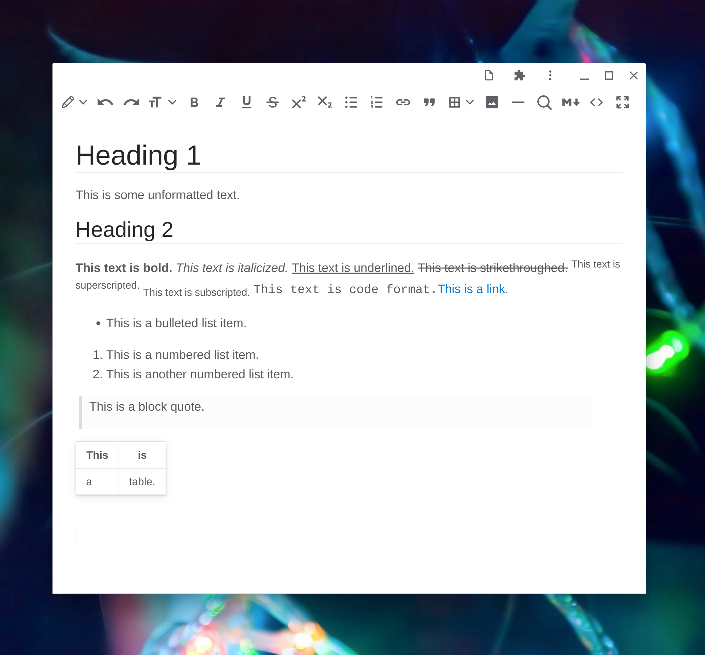

# Text Editor

Text Editor is a simple constrained-rich-text and markdown editor. It is a [Progressive Web App](https://web.dev/progressive-web-apps/) (PWA) made with [TinyMCE 5](https://github.com/tinymce/tinymce), [Showdown](https://github.com/showdownjs/showdown) (via a modified [TinyMCE labs plugin](https://www.tiny.cloud/labs/markdown/)), and the emerging [Native File System](https://web.dev/native-file-system/) (NFS) API (via Google's demo [Text Editor](https://github.com/GoogleChromeLabs/text-editor) code).

If you like this application, consider [buying Aly W. a cup of boba tea](https://www.buymeacoffee.com/alyw234237). 🧋

## Launch

Visit this link to launch the application:

* [https://alyw234237.github.io/text-editor/](https://alyw234237.github.io/text-editor/)

Make sure that your web browser is up to date and you have Native File System enabled (e.g., in Google Chrome flags—not enabled by default at this time):

* [chrome://flags/#native-file-system-api](chrome://flags/#native-file-system-api)
* [chrome://flags/#file-handling-api](chrome://flags/#file-handling-api)

## Screenshot

## Features

* Open and save files as markdown (MD), constrained rich-text (HTML), or plain text (TXT).
* Bidirectional live editing between rich-text, markdown, and HTML code views.
* Rich-text is constrained essentially to the formatting options of markdown and a small amount more. The rich-text features that are supported include headings, bold, italics, underline, strikethrough, superscript, subscript, bulleted lists, numbered lists, links, block quotes, code, tables, images, and horizontal lines. Everything else—e.g. font size, colors, alignment, positioning, etc.—is automatically sanitized and filtered as soon as it enters the editor.
* Automatic conversion of typed markdown syntax into rich text in rich-text editing mode. For example, typing `# Header title` will make an H1 header and typing `**This text is bold.**` will give bolded text. Links, images, task lists, and tables are not supported. In addition to markdown syntax, certain strings will convert to special characters (e.g., `--` to en dash and `---` to em dash).
* Keyboard shortcuts for editing, formatting, etc. (except where prevented by browser—e.g., Ctrl+N for new file in non-app mode). See [keyboard-shortcuts.md](keyboard-shortcuts.md) for a list.
* Works offline when installed as a PWA.
* Full, automatically detected dark mode.

## Notes

Due to the bidirectional conversion between rich text/HTML and markdown, the editor may alter your markdown files. For instance, certain characters may be escaped. Most importantly however, currently there's a limitation that causes front matter (e.g., YAML) to be removed from markdown files.

### Future

* Preferences menu.
* "Open with" / file association support (in-progress).
* Customization of rich-text appearance via stylesheet in preferences.
* Lots of bug fixes.

## Related

Similar live rich-text-oriented markdown editors (all desktop applications—mostly [Electron](https://www.electronjs.org/)-based):

* [Typora](https://typora.io/)
* [Mark Text](https://github.com/marktext/marktext)
* [Zettlr](https://github.com/Zettlr/Zettlr)
* [Uncolored](https://github.com/n457/Uncolored)
* [Abricotine](http://abricotine.brrd.fr/)
* [ghostwriter](https://wereturtle.github.io/ghostwriter/)
* [VNote](https://github.com/tamlok/vnote)
* [UNOTES](https://marketplace.visualstudio.com/items?itemName=ryanmcalister.Unotes) (extension for [VSCode](https://github.com/microsoft/vscode))

