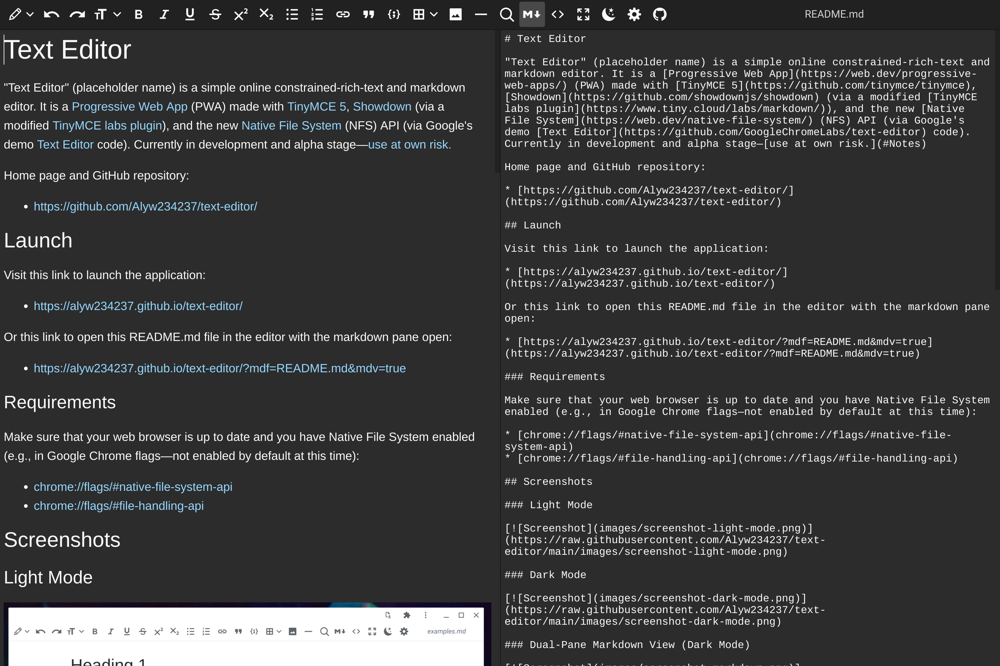

# Text Editor

Text Editor is a simple online constrained-rich-text and markdown editor. It is a [Progressive Web App](https://web.dev/progressive-web-apps/) (PWA) made with [TinyMCE 5](https://github.com/tinymce/tinymce), [Showdown](https://github.com/showdownjs/showdown) (via a modified [TinyMCE labs plugin](https://www.tiny.cloud/labs/markdown/)), and the emerging [Native File System](https://web.dev/native-file-system/) (NFS) API (via Google's demo [Text Editor](https://github.com/GoogleChromeLabs/text-editor) code). Currently in [alpha—use at own risk.](#Notes)

## Launch

Visit this link to launch the application:

* [https://alyw234237.github.io/text-editor/](https://alyw234237.github.io/text-editor/)

Make sure that your web browser is up to date and you have Native File System enabled (e.g., in Google Chrome flags—not enabled by default at this time):

* [chrome://flags/#native-file-system-api](chrome://flags/#native-file-system-api)
* [chrome://flags/#file-handling-api](chrome://flags/#file-handling-api)

## Screenshots

### Light Mode

### Dark Mode

### Dual-Pane Markdown View

## Features

* Open and save files as markdown (MD), constrained rich-text (HTML), and plain text (TXT).
* Bidirectional live editing between rich-text and markdown views. Also an HTML code view and editor.
* Rich-text is constrained essentially to the formatting options of markdown and a small amount more. The rich-text features that are supported include headings, bold, italics, underline, strikethrough, superscript, subscript, bulleted lists, numbered lists, links, block quotes, code, tables, images, and horizontal lines. Everything else—e.g. font size, colors, alignment, positioning, etc.—is automatically sanitized and filtered as soon as it enters the editor.
* Automatic conversion of typed markdown syntax into rich text in rich-text editing mode. For example, typing `# Header title` will make an H1 header and typing `This text is bold.` will give bolded text. These conversions for links, images, task lists, and tables are not supported. In addition to markdown syntax, certain strings will convert to special characters (e.g., `--` to en dash and `---` to em dash). See [pattern-conversions.md](docs/pattern-conversions.md) for a list of conversions.
* Keyboard shortcuts for editing, formatting, etc. (except where prevented by browser—e.g., Ctrl+N for new file in non-app mode). See [keyboard-shortcuts.md](docs/keyboard-shortcuts.md) for a list.
* Works offline when installed as a PWA.
* Mobile-friendly.
* Dark mode.
* Optional customization of rich-text appearance via CSS in preferences.

## Notes

The editor is still under development and is very buggy.

Due to the bidirectional conversion between rich text/HTML and markdown, the editor may alter your markdown files in unanticipated and/or undesirable ways. For instance, right now there's a bug that causes front matter (e.g., YAML) to be removed from markdown files. These are because of the internal Showdown conversion engine.

Use at your own risk.

### Future

* "Open with" / file association support.
* Lots of bug fixes and minor features.
* Other things...

## Related

A number of similar editors exist. These are either rich-text-oriented markdown editors (mostly [Electron](https://www.electronjs.org/)-based desktop applications) or online markdown editors:

| Desktop | Web |
| --- | --- |
| [Typora](https://typora.io/) | [StackEdit](https://stackedit.io/) |
| [Mark Text](https://github.com/marktext/marktext) | [SimpleMDE](https://simplemde.com/) |
| [Zettlr](https://github.com/Zettlr/Zettlr) | [Dillinger](https://dillinger.io/) |
| [Uncolored](https://github.com/n457/Uncolored) | [Editor.md](http://editor.md/) |
| [Abricotine](http://abricotine.brrd.fr/) | [More...](https://www.webfx.com/blog/web-design/online-markdown-editors/) |
| [ghostwriter](https://wereturtle.github.io/ghostwriter/) |  |
| [VNote](https://github.com/tamlok/vnote) |  |
| [UNOTES](https://marketplace.visualstudio.com/items?itemName=ryanmcalister.Unotes) ([VSCode](https://github.com/microsoft/vscode) extension) |  |

## Support

If you like this application, consider [buying Aly W. a cup of boba tea](https://www.buymeacoffee.com/alyw234237). 🧋

